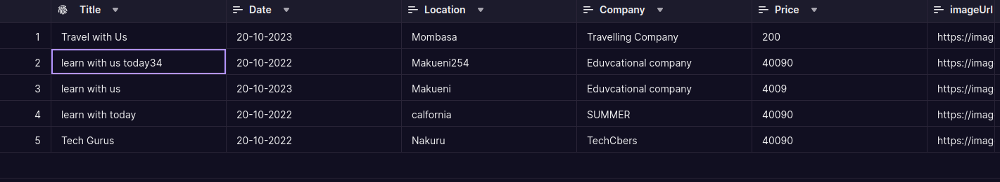
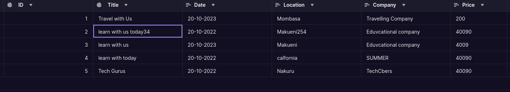
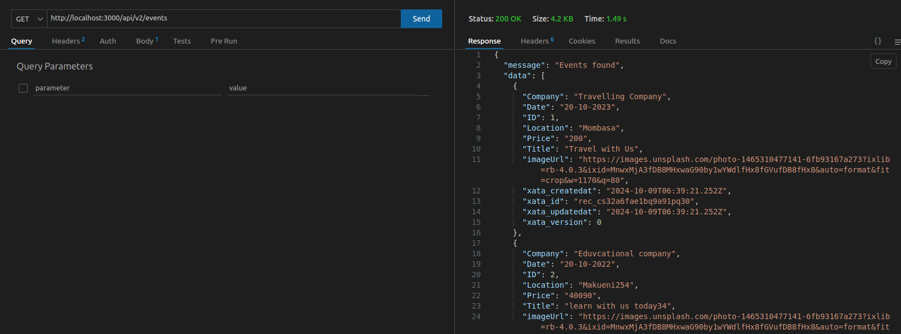
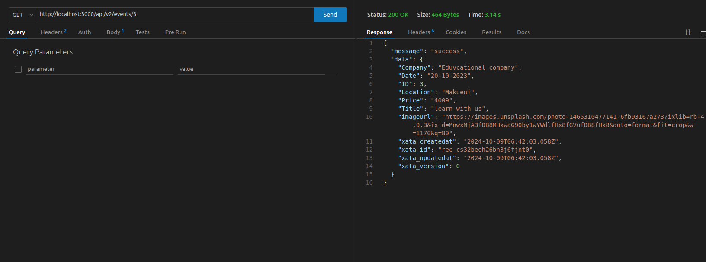
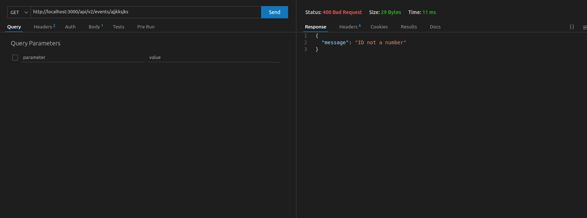
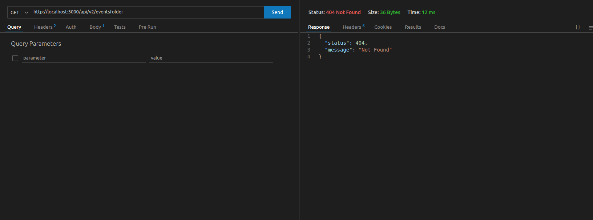
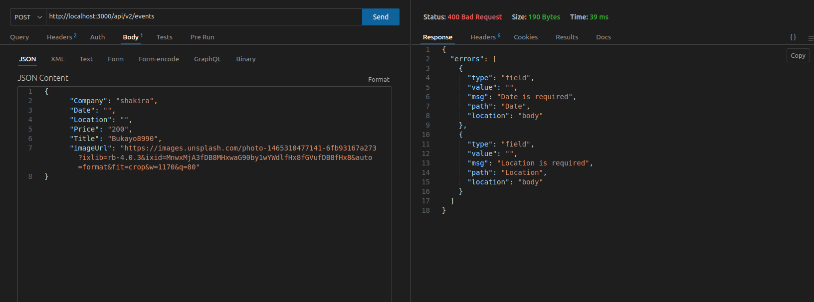

# Cart Management System


 
 
 
 
 
 

## Overview

The Cart Management System is a web application designed to manage events, including creating, updating, deleting, and fetching event details. The system is built using Node.js and Express, with data stored in a Xata database.

## Features

- **Create Event**: Add new events with details such as company, date, location, price, title, and image URL.
- **Update Event**: Modify existing event details.
- **Delete Event**: Remove events from the system.
- **Fetch Events**: Retrieve details of all events or a specific event by ID.

## Installation

1. Clone the repository:
    ```sh
    git clone https://github.com/urbanus-dev/ExpessJs/tree/main/CartManagement.git
    cd cart-management
    ```

2. Install dependencies:
    ```sh
    npm install
    ```

3. Set up environment variables:
    Create a `.env` file in the root directory and add the following:
    ```env
    PORT=3009
    XATA_API_KEY=your_xata_api_key
    ```

4. Start the server:
    ```sh
    npm start
    ```

## API Endpoints

### Fetch All Events
- **URL**: `/api/v2/events`
- **Method**: `GET`
- **Response**: List of all events

### Fetch Event by ID
- **URL**: `/api/v2/events/:id`
- **Method**: `GET`
- **Params**: `id` (Event ID)
- **Response**: Details of the specified event

### Create Event
- **URL**: `/api/v2/events`
- **Method**: `POST`
- **Body**:
    ```json
    {
      "Company": "Tech Gurus",
      "Date": "2019-03-20",
      "Location": "Nakuru",
      "Price": "40090",
      "Title": "Tech Gurus56",
      "imageUrl": "https://images.unsplash.com/photo-1465310477141-6fb93167a273?ixlib=rb-4.0.3&ixid=MnwxMjA3fDB8MHxwaG90by1wYWdlfHx8fGVufDB8fHx8&auto=format&fit=crop&w=1170&q=80"
    }
    ```
- **Response**: Details of the created event

### Update Event
- **URL**: `/api/v2/events/:id`
- **Method**: `PATCH`
- **Params**: `id` (Event ID)
- **Body**: Fields to update
- **Response**: Details of the updated event

### Delete Event
- **URL**: `/api/v2/events/:id`
- **Method**: `DELETE`
- **Params**: `id` (Event ID)
- **Response**: Confirmation of event deletion

## Validation

The system uses `express-validator` for request validation. The following fields are validated:

- **Company**: Must not be empty
- **Date**: Must be a valid date in `YYYY-MM-DD` format
- **Location**: Must not be empty
- **Price**: Must not be empty
- **Title**: Must not be empty
- **imageUrl**: Must not be empty

## Error Handling

The system includes middleware for handling errors, including validation errors and general server errors.
